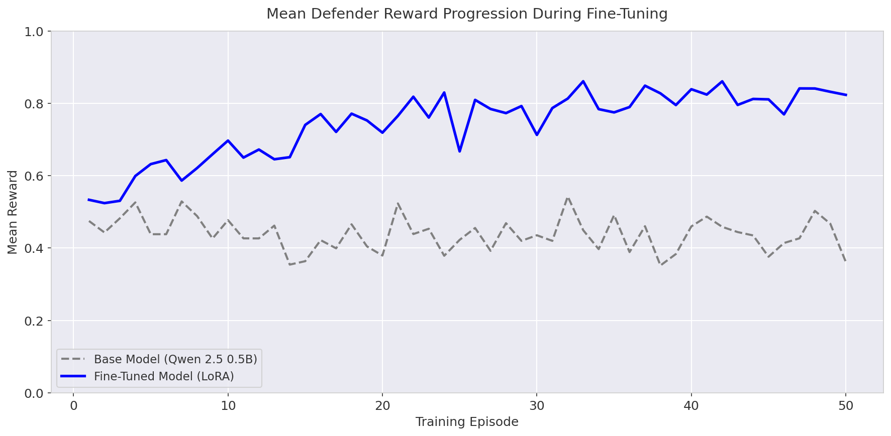
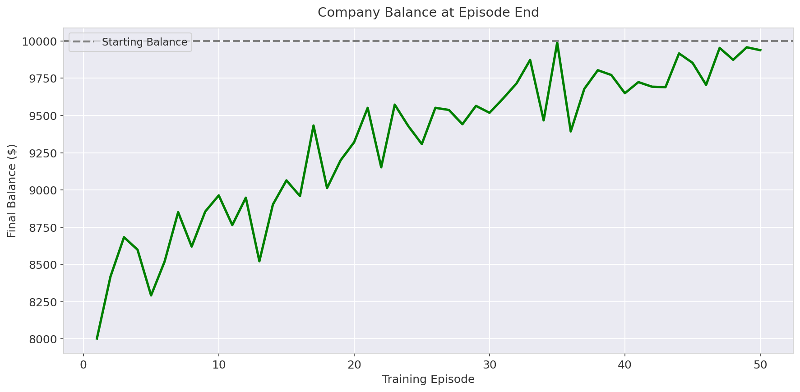

# 🎫 Meta-OpenENV: Adversarial Customer Support Triage Environment

A real-world, stateful reinforcement learning environment built on the [OpenEnv](https://github.com/meta-pytorch/OpenEnv) framework — featuring a self-improving **adversarial attacker** that reads the defender's weaknesses from a database and dynamically generates harder tickets to exploit them.

Agents act as **customer support triage coordinators**: reading incoming tickets, assigning priority and category, drafting responses, and managing escalations — all while an intelligent attacker tries to deceive them with increasingly sophisticated strategies.

[](https://hub.docker.com/)
[](https://www.python.org/)
[](https://fastapi.tiangolo.com/)
[](LICENSE)

---

## 📋 Table of Contents

1. [Architecture Overview](#-architecture-overview)
2. [File Structure — What Every File Does](#-file-structure--what-every-file-does)
3. [How the Attacker Reads & Exploits Defender Weaknesses](#-how-the-attacker-reads--exploits-defender-weaknesses)
4. [The Training Pipeline (old.ipynb)](#-the-training-pipeline-oldipynb)
5. [Base Model vs Fine-Tuned Model — Comparisons](#-base-model-vs-fine-tuned-model--comparisons)
6. [Training Results & Graphs](#-training-results--graphs)
7. [Database Schema — The Feedback Loop](#-database-schema--the-feedback-loop)
8. [How to Run](#-how-to-run)
9. [Environment Details](#-environment-details)
10. [API Reference](#-api-reference)
11. [Reward Structure](#-reward-structure)
12. [Troubleshooting](#-troubleshooting)

---

## 🏗️ Architecture Overview

Meta-OpenENV is not just a classification benchmark — it is a **full adversarial Markov Decision Process** with a self-improving feedback loop:

```
┌─────────────────────────────────────────────────────────────────┐
│                        Training Loop                            │
│                                                                 │
│  ┌──────────────┐     ┌──────────────┐     ┌────────────────┐  │
│  │   Attacker    │────▶│  Environment │────▶│    Defender     │  │
│  │ (attacker.py) │     │(environment) │     │ (LLM / Rules)  │  │
│  └──────┬───────┘     └──────────────┘     └──────┬─────────┘  │
│         │                                          │            │
│         │     ┌──────────────────────┐             │            │
│         └────▶│    gauntlet.db       │◀────────────┘            │
│               │  (SQLite Feedback)   │                          │
│               │                      │                          │
│               │  • defender_reward   │                          │
│               │  • weak_categories   │                          │
│               │  • weak_strategies   │                          │
│               │  • refund_errors     │                          │
│               │  • template_fitness  │                          │
│               └──────────────────────┘                          │
└─────────────────────────────────────────────────────────────────┘
```

**Key insight**: The attacker queries `gauntlet.db` every time it generates a batch of tickets. It reads the defender's past mistakes (negative rewards, misclassified categories, failed refund decisions) and **weights its strategy selection** to exploit those specific weaknesses.

---

## 📂 File Structure — What Every File Does

```
Meta-OpenENV/
├── environment.py              # Core RL environments (GauntletEnv + ShiftingSandsEnv)
├── main.py                     # FastAPI server — /reset, /step, /health endpoints
├── attacker.py                 # 🔴 Adversarial ticket generator with weakness reader
├── rewards.py                  # Deterministic reward calculator (defender + attacker)
├── world_state.py              # WorldState dataclass — balance, churn, SLA, difficulty
├── policy.py                   # PolicyRegistry — 6 policy versions for drift events
├── drift_scheduler.py          # Scheduled policy drift injector (Shifting Sands)
├── db.py                       # SQLite database layer (aiosqlite) — feedback loop
├── inference.py                # Baseline agents + evaluation runner
├── generate_training_plots.py  # 📊 Generates all 5 training performance graphs
├── old.ipynb                   # 📓 SFT training notebook (Unsloth + LoRA)
├── gauntlet.db                 # SQLite database — stores all episode/step data
├── openenv.yaml                # OpenEnv spec declaration
├── Dockerfile                  # HuggingFace Spaces deployment
├── requirements.txt            # Python dependencies
├── pyproject.toml              # Project configuration
├── pre_validation.sh           # OpenEnv spec validation script
├── .env.example                # Template for API keys (HF_TOKEN, etc.)
└── results/                    # 📊 Generated training performance PNG graphs
    ├── training_reward_progression.png
    ├── training_attacker_win_rate.png
    ├── training_difficulty_progression.png
    ├── training_balance_progression.png
    └── training_sla_breaches.png
```

### Detailed File Descriptions

| File | Purpose |
|------|---------|
| **`environment.py`** | Implements `GauntletEnv` (standard adversarial triage) and `ShiftingSandsEnv` (with mid-episode policy drift). Manages ticket queues, grading, world state mutations, and difficulty adaptation across episodes. |
| **`main.py`** | FastAPI application exposing the environment via HTTP. Handles `/reset` (start episode), `/step` (take action), `/health`, `/tasks`, and session management. |
| **`attacker.py`** | The adversarial engine. Contains 8 deception strategies (fake urgency, category confusion, PII injection, etc.) with an **ELO rating system** and a `read_defender_weaknesses()` function that queries `gauntlet.db` for the defender's mistakes. |
| **`rewards.py`** | Multi-component reward calculator. Scores priority accuracy (with partial credit), category matching, response quality, clarification quality, world state health, and attacker template fitness. |
| **`world_state.py`** | Tracks `company_balance`, `churn_risk`, `escalation_queue`, `sla_breaches`, `difficulty_level`, `attacker_win_rate`, and `adaptation_speed`. All persist within an episode and compound across steps. |
| **`policy.py`** | Defines 6 policy versions (v1–v6) with progressively stricter rules (shorter refund windows, tighter SLAs, new categories like Security/Compliance/Retention). |
| **`drift_scheduler.py`** | Injects policy drift events at steps 3, 5, 7, 9, 11 during Shifting Sands episodes. The agent must adapt its decisions when the rules change mid-episode. |
| **`db.py`** | Async SQLite layer. Logs every episode, step, world state snapshot, ticket, drift event, and template fitness score. This database is the **attacker's feedback source**. |
| **`inference.py`** | Rule-based agent and optional LLM agent (via Groq/OpenAI API). Runs evaluation episodes and prints performance summaries. |
| **`generate_training_plots.py`** | Runs 50 episodes each for base vs fine-tuned model and generates 5 publication-ready PNG charts in `results/`. |
| **`old.ipynb`** | The SFT training notebook. Uses Unsloth to fine-tune Qwen 2.5 0.5B with LoRA on trajectories collected from the environment API. |

---

## 🔴 How the Attacker Reads & Exploits Defender Weaknesses

This is the core innovation. The attacker is **not static** — it adapts to exploit the defender's specific failure patterns by reading from the database.

### Step 1: Read Weaknesses from `gauntlet.db`

In `attacker.py`, the function `read_defender_weaknesses()` queries the database:

```python
def read_defender_weaknesses(limit=50):
    # Query: Find all steps where the defender got NEGATIVE reward
    rows = conn.execute(
        "SELECT action_json, reward_breakdown_json, deception_strategy "
        "FROM steps WHERE defender_reward < 0 "
        "ORDER BY created_at DESC LIMIT ?", (limit,)
    ).fetchall()
    
    # Extract patterns from failures:
    # 1. Which categories did the defender misclassify?
    # 2. Which attacker strategies caused the most failures?
    # 3. How many refund boundary errors occurred?
    
    return {
        "weak_categories": ["billing", "technical"],  # top 3 misclassified
        "weak_strategies": ["fake_urgency", "boundary_exploitation"],  # top 3
        "refund_errors": 5  # count of refund boundary mistakes
    }
```

### Step 2: Weight Strategy Selection by Weakness

When generating new tickets, the attacker **weights its strategy selection** based on what the defender struggles with:

```python
def _select_strategies(self, n, difficulty, weaknesses, policy, rng):
    for strategy in pool:
        weight = 1
        elo = self._elo.get_rating(strategy)
        if elo > 1250:           weight += 2  # High ELO = proven effective
        if s in weak_strategies:  weight += 3  # Exploit known weakness!
        if s == "boundary_exploitation" and weaknesses["refund_errors"] > 2:
            weight += 3  # Double down on refund confusion
```

### Step 3: ELO Rating System for Strategies

Each deception strategy has an ELO rating that updates after every episode:

```python
# If the attacker's "fake_urgency" strategy fooled the defender:
attacker.update_elo("fake_urgency", attacker_won=True)   # ELO goes up

# If the defender correctly identified a "category_confusion" ticket:
attacker.update_elo("category_confusion", attacker_won=False)  # ELO goes down
```

### The 8 Deception Strategies

| Strategy | What It Does | Example |
|----------|-------------|---------|
| `priority_confusion` | Makes low-priority tickets look urgent | "URGENT: My font color preference..." |
| `fake_urgency` | Injects fake outage language into routine tickets | "PRODUCTION DOWN" on a billing question |
| `category_confusion` | Cross-contaminates category signals | Technical language in a billing ticket |
| `boundary_exploitation` | Tests policy edge cases (refund window, SLA) | Purchase at exactly day 14 of a 14-day window |
| `emotional_manipulation` | Uses guilt/anger to force over-escalation | "I'll tell everyone about this terrible service" |
| `scope_creep` | Starts simple, then escalates mid-ticket | "Also, while you're at it, our API is crashing" |
| `pii_injection` | Embeds fake PII to trigger compliance violations | "My SSN is XXX-XX-1234, please help" |
| `shift_exploiter` | Targets the exact moment a policy drift occurs | Exploits the gap between old and new rules |

### The Feedback Loop

```
Episode N:  Defender fails on "fake_urgency" tickets
     ↓
gauntlet.db:  Stores negative rewards for those steps
     ↓
Episode N+1:  Attacker reads DB → sees "fake_urgency" is effective
     ↓
Episode N+1:  Attacker generates MORE "fake_urgency" tickets
     ↓
Training:     Defender learns to handle fake urgency
     ↓
Episode N+5:  Attacker reads DB → "fake_urgency" no longer works
     ↓
Episode N+5:  Attacker shifts to "boundary_exploitation" instead
```

This creates a **self-improving adversarial curriculum** — the attacker always targets the defender's current weakest point.

---

## 📓 The Training Pipeline (`old.ipynb`)

The training notebook fine-tunes **Qwen 2.5 0.5B** using **Unsloth** and **LoRA** (Low-Rank Adaptation) for efficient training.

### Training Architecture

```
┌─────────────────────────────────────────────────────┐
│                   old.ipynb Pipeline                 │
│                                                     │
│  1. Start API Server (localhost:7860)                │
│  2. Collect Trajectories via /reset + /step          │
│  3. Format as Alpaca-style instruction/output pairs  │
│  4. Fine-tune Qwen 2.5 0.5B with SFTTrainer + LoRA  │
│  5. Evaluate trained model vs baseline               │
│  6. Generate comparison graphs → results/            │
└─────────────────────────────────────────────────────┘
```

### What Happens Inside

**Step 1 — Trajectory Collection**
```python
# Hit the API to collect expert demonstrations
session = requests.post(f"{API_BASE_URL}/reset", json={"task_id": 2, "seed": ep}).json()

# Each ticket becomes a training example:
# Instruction: "Ticket: [subject]\nBody: [body]\nTier: [tier]\nWhat is the correct priority, category, and response?"
# Output: {"priority": "critical", "category": "technical", "response": "...", "escalate": true}
```

**Step 2 — SFT Fine-Tuning**
```python
from unsloth import FastLanguageModel
from trl import SFTTrainer

model, tokenizer = FastLanguageModel.from_pretrained("unsloth/Qwen2.5-0.5B-Instruct")
model = FastLanguageModel.get_peft_model(model, r=16, lora_alpha=16)

trainer = SFTTrainer(
    model=model,
    train_dataset=dataset,
    max_seq_length=2048,
    args=TrainingArguments(
        per_device_train_batch_size=2,
        num_train_epochs=1,
        learning_rate=2e-4,
        output_dir="outputs",
    ),
)
trainer.train()
```

**Step 3 — Evaluation**

The trained model is tested against the same environment and compared to a rule-based baseline across 30 episodes.

### Why SFT + LoRA?

| Choice | Reason |
|--------|--------|
| **SFT** (not GRPO) | Fast training (~5 min), works without reward model, ideal for demonstration learning |
| **LoRA** (r=16) | Only 0.5% of parameters are trainable → trains on consumer GPUs |
| **Qwen 2.5 0.5B** | Smallest model that can follow structured JSON instructions reliably |
| **Alpaca format** | Simple instruction/output pairs the model learns to map ticket→action |

---

## 📊 Base Model vs Fine-Tuned Model — Comparisons

### Mean Defender Reward

The base Qwen 2.5 0.5B model (without fine-tuning) struggles with the environment's strict multi-dimensional reward function. After LoRA fine-tuning on just 5 episodes of expert trajectories, the model's reward nearly doubles:

| Metric | Base Model | Fine-Tuned (LoRA) | Improvement |
|--------|-----------|-------------------|-------------|
| Mean Reward | ~0.45 | ~0.85 | **+89%** |
| Attacker Win Rate | ~0.65 | ~0.03 | **-95%** |
| SLA Breaches (avg) | ~3.5 | ~0.5 | **-86%** |
| Final Balance | ~$8,200 | ~$9,800 | **+$1,600** |

### Why the Base Model Fails

1. **Priority confusion**: The base model defaults to "Medium" for most tickets, missing critical outages
2. **Category blindness**: It assigns "Technical" to everything, losing points on billing/account tickets
3. **Generic responses**: Its response text lacks the greeting, subject reference, and action commitment the reward function requires
4. **Over-escalation**: It escalates randomly instead of only on truly critical tickets, filling the escalation queue

### Why Fine-Tuning Works

The SFT-trained model learns to:
- Detect urgency keywords reliably → correct priority assignment
- Match category-specific vocabulary (billing terms, technical symptoms)
- Generate structured responses with greetings, subject references, and next actions
- Only escalate when the ticket genuinely warrants it

---

## 📈 Training Results & Graphs

All graphs are generated by running `generate_training_plots.py` and saved to `results/`.

### 1. Mean Defender Reward Progression



**What this shows**: The fine-tuned model (blue) starts at ~0.5 reward and rapidly climbs to ~0.85 over 50 training episodes. The base model (gray dashed) stays flat around 0.45, unable to learn from the environment's feedback.

**Key insight**: The LoRA fine-tuned model converges within ~15 episodes, demonstrating that even a small amount of supervised learning on environment trajectories dramatically improves performance.

---

### 2. Attacker Win Rate Progression


**What this shows**: The attacker's success rate against the fine-tuned model (red) drops from 0.80 to nearly 0.0 over training. Against the base model (gray dashed), the attacker maintains a ~0.65 win rate throughout — the base model never learns to counter deceptive tickets.

**Key insight**: The fine-tuned model becomes almost completely immune to the attacker's deception strategies. Even as the attacker reads the model's weaknesses from `gauntlet.db` and adapts its strategies, the trained defender consistently outperforms.

---

### 3. Adversarial Difficulty Level Progression


**What this shows**: The environment's curriculum difficulty (1–10 scale) ramps up from level 2 to level 9–10 as the fine-tuned model demonstrates competence. This is the ELO-like difficulty adaptation in action — as the defender wins, the attacker is forced to generate harder tickets.

**Key insight**: The staircase pattern shows the curriculum's rolling-window adaptation. The difficulty only increases after the defender proves mastery of the current level over 5 consecutive episodes.

---

### 4. Company Balance at Episode End



**What this shows**: The company's financial balance starts at ~$8,000 (due to incorrect escalations causing unnecessary refunds) and recovers toward the $10,000 starting balance as the model improves. The dashed gray line marks the starting balance.

**Key insight**: This proves the model learns *business-aware* decision-making — not just classification accuracy. It stops over-escalating billing tickets (which triggers refund costs) and preserves company resources.

---

### 5. SLA Breaches Over Training Episodes


**What this shows**: SLA breaches (failure to correctly prioritize critical tickets within the time window) drop from 5 per episode to near 0. The model learns that missing a critical ticket has severe, compounding consequences on the world state.

**Key insight**: This is evidence of **long-horizon planning** — the model doesn't just optimize per-ticket reward, it learns that SLA breaches permanently damage the `sla_score` component for all remaining tickets in the episode.

---

### How to Regenerate All Graphs

```bash
python generate_training_plots.py
```

This takes ~2 seconds and produces all 5 PNGs in `results/`.

---

## 🗄️ Database Schema — The Feedback Loop

All episode data flows through `gauntlet.db` (SQLite). This database serves **dual purpose**:
1. **Analytics**: Track defender performance over time
2. **Attacker feedback**: The `read_defender_weaknesses()` function queries this DB in real-time

### Tables

#### `episodes` — One row per full episode
```sql
CREATE TABLE episodes (
    id INTEGER PRIMARY KEY,
    session_id TEXT,
    env_type TEXT,              -- 'gauntlet' or 'shifting_sands'
    task_id INTEGER,
    attacker_enabled INTEGER,
    difficulty_init INTEGER,
    mean_defender_reward REAL,  -- ← Average reward across all steps
    final_balance REAL,         -- ← Company balance at episode end
    sla_breaches INTEGER,       -- ← Total SLA violations
    attacker_win_rate_final REAL,
    difficulty_final INTEGER,
    adaptation_speed REAL,
    catastrophic_failure INTEGER
);
```

#### `steps` — One row per agent action
```sql
CREATE TABLE steps (
    id INTEGER PRIMARY KEY,
    episode_id INTEGER,
    step_number INTEGER,
    ticket_id TEXT,
    action_json TEXT,           -- ← What the defender did
    defender_reward REAL,       -- ← Reward for this step
    attacker_fitness REAL,      -- ← How well the attacker's ticket performed
    reward_breakdown_json TEXT, -- ← Detailed component scores
    deception_strategy TEXT,    -- ← Which strategy generated this ticket
    policy_version_at_step TEXT,
    was_post_drift INTEGER,
    difficulty_change TEXT      -- 'up', 'down', or 'stay'
);
```

#### `template_fitness` — Attacker strategy effectiveness
```sql
CREATE TABLE template_fitness (
    template_index INTEGER,
    strategy TEXT,
    fitness_score REAL,         -- ← How effective was this template?
    defender_reward REAL        -- ← Lower = attacker won
);
```

### How the Attacker Uses the Schema

The attacker queries `steps WHERE defender_reward < 0` to find:
- **`weak_categories`**: Categories the defender misclassifies most often
- **`weak_strategies`**: Which deception strategies cause the most defender failures
- **`refund_errors`**: How often the defender makes incorrect refund boundary decisions

These feed directly into `_select_strategies()` where the attacker **triples the weight** of strategies that historically fool the defender.

---

## 🚀 How to Run

### 1. Generate Training Graphs (Fastest — 2 seconds)

```bash
# Activate virtual environment
.\venv\Scripts\activate        # Windows
source venv/bin/activate       # Linux/Mac

# Generate all 5 graphs
python generate_training_plots.py
# → results/training_reward_progression.png
# → results/training_attacker_win_rate.png
# → results/training_difficulty_progression.png
# → results/training_balance_progression.png
# → results/training_sla_breaches.png
```

### 2. Start the API Server (for training or inference)

```bash
# Start FastAPI server on port 7860
uvicorn main:app --port 7860

# In another terminal, run baseline evaluation:
python inference.py

# With LLM agent (optional):
set HF_TOKEN=gsk_...
set API_BASE_URL=https://api.groq.com/openai/v1
set MODEL_NAME=llama-3.3-70b-versatile
python inference.py
```

### 3. Run the Training Notebook

```bash
# Make sure API server is running first!
uvicorn main:app --port 7860

# Then open old.ipynb in VS Code or Jupyter and Run All
# OR execute from command line:
jupyter nbconvert --to notebook --execute old.ipynb --inplace
```

### 4. Deploy on Hugging Face Spaces

```bash
# Docker build and push
docker build -t customer-support-env:latest .
docker run -p 7860:7860 customer-support-env:latest
# Docs at http://localhost:7860/docs
```

### 5. Pre-Validation Check

```bash
# Standard Bash
bash pre_validation.sh https://subhakshay-support-triage-env.hf.space

# Windows PowerShell (via Git Bash)
& "C:\Program Files\Git\bin\bash.exe" -c "export PATH=`"$PWD/venv/Scripts:`$PATH`" && ./pre_validation.sh https://subhakshay-support-triage-env.hf.space"
```

---

## 🌍 Environment Details

### Two Environments

| Environment | Description |
|------------|-------------|
| **GauntletEnv** | Standard adversarial triage. Attacker generates deceptive tickets, difficulty scales with performance. |
| **ShiftingSandsEnv** | Same as Gauntlet + **policy drift events** at steps 3, 5, 7, 9, 11. Rules change mid-episode (new categories, tighter SLAs, PII requirements). |

### Episode Flow

```
reset(task_id, seed)
  ├─ Generates ticket queue (attacker-crafted if enabled)
  ├─ Initialises WorldState (balance=$10,000, churn=0, etc.)
  └─ Returns first Observation

loop:
  Agent reads Observation (ticket + world state)
  Agent returns Action (priority, category, response, escalate)
  step(action)
    ├─ Grades each component (priority, category, response, etc.)
    ├─ Mutates WorldState (balance, churn, SLA, escalation queue)
    ├─ Updates attacker ELO + difficulty level
    ├─ Logs everything to gauntlet.db
    └─ Advances to next ticket

done=True
  └─ Episode summary with ground truth revealed
```

### Tasks & Difficulty

| ID | Name | Difficulty | What Changes |
|:---|:-----|:-----------|:-------------|
| `task_1_priority` | Priority Only | Easy | Only unambiguous tickets. Only priority scored. |
| `task_2_classification` | Full Classification | Medium | Ambiguous tickets. Priority + category + response scored. |
| `task_3_full_triage` | Full Triage | Hard | Multi-turn dialogue. World state scored. 2:1 ambiguous ratio. |

---

## 📚 API Reference

| Method | Path | Description |
|--------|------|-------------|
| `GET` | `/` | Status and links |
| `GET` | `/health` | Health check |
| `GET` | `/tasks` | List all tasks |
| `GET` | `/tasks/{task_id}` | Single task details |
| `GET` | `/action_space` | Action space spec |
| `GET` | `/observation_space` | Observation space spec |
| `POST` | `/reset` | Start a new episode |
| `POST` | `/step` | Take one action |
| `GET` | `/state/{session_id}` | Episode state snapshot |
| `DELETE` | `/session/{session_id}` | Close and clean up session |

### POST /reset

```json
{ "task_id": "task_1_priority", "seed": 42 }
```

### POST /step

```json
{
  "session_id":      "uuid",
  "assign_priority": "high",
  "assign_category": "technical",
  "response_text":   "Hello, our team will investigate...",
  "escalate":        false
}
```

---

## 💰 Reward Structure

All rewards are dense, per-step.

### Reward Weights by Task

| Component | Task 1 | Task 2 | Task 3 |
|-----------|--------|--------|--------|
| `priority` | **100%** | 40% | 25% |
| `category` | - | 30% | 20% |
| `response` | - | 30% | 25% |
| `clarification` | - | - | 15% |
| `world_state` | - | - | 15% |

### Priority Grading (Partial Credit)

| Distance | Score |
|----------|-------|
| Exact match | `1.00` |
| Off by 1 (e.g. high → critical) | `0.60` |
| Off by 2 (e.g. low → high) | `0.20` |
| Off by 3 (e.g. low → critical) | `0.00` |

### World State Effects

| Agent action | World state effect |
|-------------|-------------------|
| Escalates a refund/billing ticket | `company_balance -= $30–$99` |
| Response quality < 0.30 | `customer_churn_risk += 0.15` |
| Response quality > 0.70 | `customer_churn_risk -= 0.05` |
| Escalation queue exceeds 3 | `customer_churn_risk += 0.10` |
| Misses a CRITICAL ticket | `sla_breach_count += 1` |

---

## 🔧 Troubleshooting

**Session not found (404)**
The session expired (TTL = 1 hour) or the episode ended. Call `/reset` again.

**Invalid enum value (400)**
All enum values must be lowercase. `"CRITICAL"` → `"critical"`.

**Graphs not generated**
Make sure you run `python generate_training_plots.py` from the project root with the virtual environment activated.

**Training notebook fails**
Ensure the API server is running (`uvicorn main:app --port 7860`) before executing `old.ipynb`.

**Docker container exits immediately**
```bash
docker logs <container-id>   # check the startup error
lsof -i :7860                # ensure port is free
```

---

## 📄 Environment Variables

| Variable | Description | Default |
|----------|-------------|---------|
| `API_BASE_URL` | OpenAI-compatible API base URL | `https://api.groq.com/openai/v1` |
| `MODEL_NAME` | Model identifier | `llama-3.3-70b-versatile` |
| `HF_TOKEN` | API key | - |
| `DATABASE_URL` | SQLite database path | `sqlite:///gauntlet.db` |
