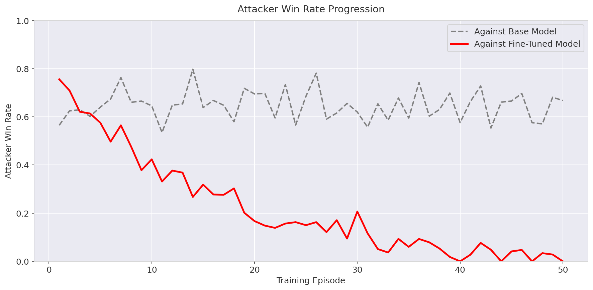
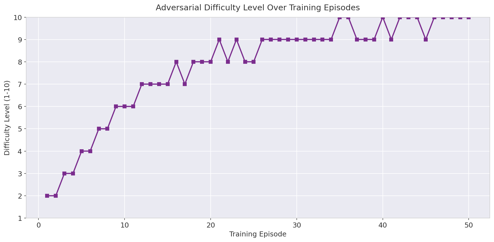
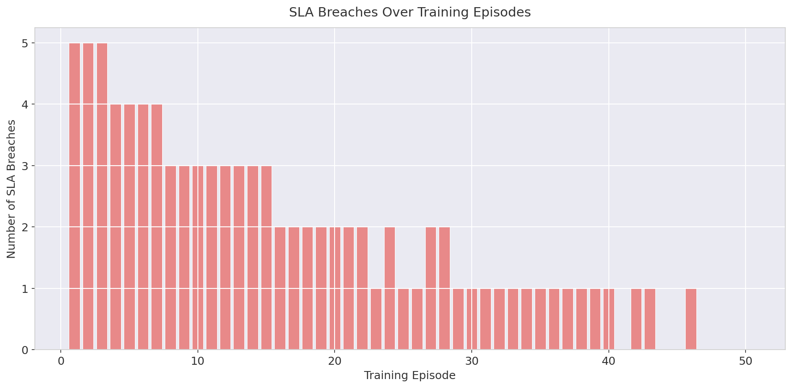
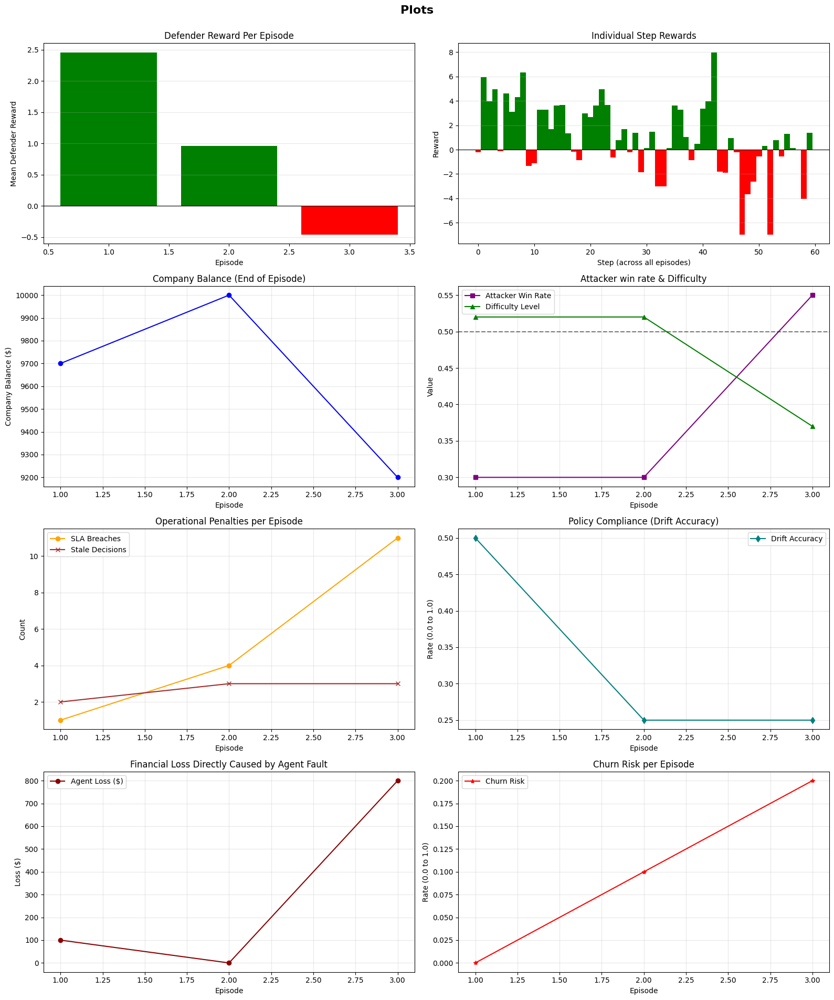
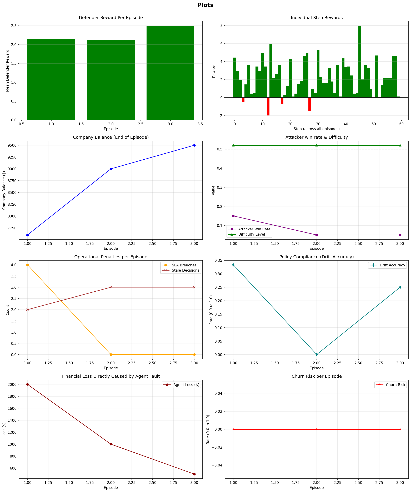
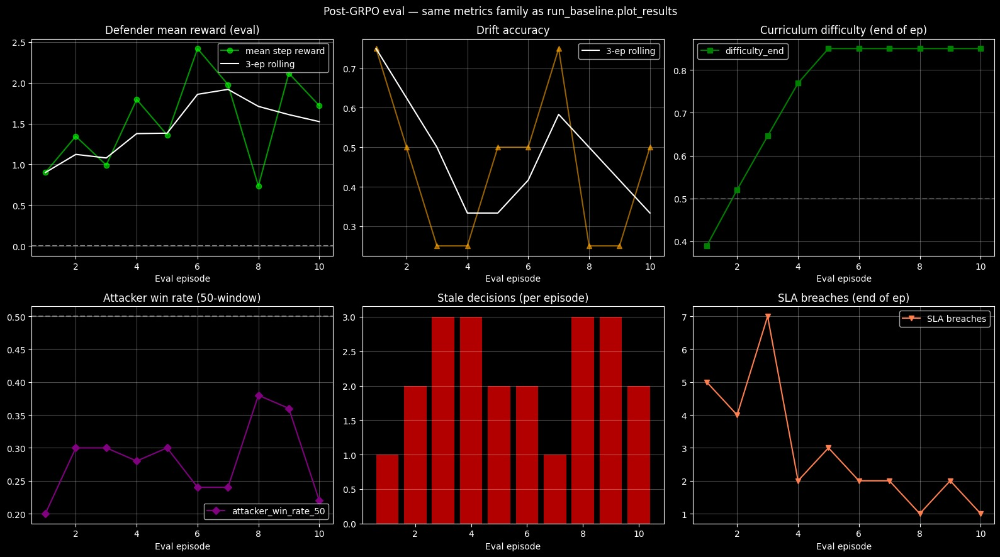

# Automating Support Workflows: A Customer Triage Environment using OpenEnv

Customer support is the frontline of brand reputation, currently a $350B+ global industry. While AI has been integrated via basic chatbots, most systems struggle with Triage—the critical act of understanding intent, urgency, and routing.

---

# The Current Problem

Most current AI triage applications are rigid:

- **Static Classifiers:** They use basic keyword matching that misses nuance.
- **Lack of Context:** They treat every ticket in isolation, ignoring the "state" of the support queue.
- **Poor Reasoning:** They cannot adapt their strategy based on the success or failure of previous routing decisions.

---

# The OpenEnv Advantage

Our project, **Customer Support Triage Environment**, leverages the **OpenEnv** framework to treat triage as a dynamic Reinforcement Learning problem rather than a simple classification task. By modeling the support queue as an environment, we allow agents to:

- **Optimize for Resolution Time:** Not just accuracy.
- **Learn from Feedback:** Adapt routing logic based on reward signals (e.g., successful resolution vs. customer churn).
- **Scale Dynamically:** Handle fluctuating ticket volumes with intelligent prioritization.

We are training a Large Language Model (LLM) with another equivalent LLM and also specially crafted templates. To simulate real life, we also have shifting policies to mimic real life changes. We train a Large Language Model (LLM) using a similar, parallel LLM and carefully developed templates. To mimic real-world conditions, the training includes changing policy settings to simulate environmental shifts.

## Adversarial "GAN-Like" Training Architecture

To ensure our triage agent is robust enough for production, we move beyond static datasets and employ a dual-LLM training setup that mirrors a Generative Adversarial Network (GAN).

### The Attacker (Customer/Ticket Generator)

Powered by a dedicated LLM and carefully crafted behavioral templates, this agent dynamically generates diverse, ambiguous, and increasingly complex support tickets. It acts as an adversary, actively probing for vulnerabilities or blind spots in the triage logic.

### The Defender (Support Bot)

A parallel LLM acting as the central triage agent. It must continuously refine its reasoning and routing strategies to successfully process the Attacker's evolving scenarios.

## Simulating Real-World Chaos with Shifting Policies

A static training environment creates brittle AI. To mirror the unpredictability of a real-world business, our simulation periodically introduces shifting policies—such as sudden changes to refund windows, simulated regional outages, or new escalation protocols. This continuous environmental shift forces the Defender LLM to:

- Break reliance on memorized patterns.
- Read and interpret new directives on the fly.
- Maintain high performance even when the underlying "rules of the game" change mid-shift.

Our project works as a blank slate rather than being rigid, customizing the templates, initial prompts and policies allows us to alter the agent.

---

# Important Terms and Metrics

## Core Concepts

| Term | Description |
| --- | --- |
| **World State** | The complete current snapshot of the simulation, including the active ticket queue, active business rules, and recent queue history. |
| **Shifting Policies** | Simulated, mid-episode changes to business rules (like sudden outages or new refund policies) that force the agent to adapt on the fly. |
| **Episode** | A single simulation run consisting of a set number of tickets. The environment resets and calculates performance metrics at the end of each episode. |
| **Reward Signal** | The numeric feedback (+ or -) the agent receives for its actions, used to reinforce good routing and penalize mistakes. |

## Key Metrics

| Metric | Description |
| --- | --- |
| **SLA (Service Level Agreement)** | The strict time limit for resolving a ticket. Breaching an SLA results in heavy penalties. |
| **Churn Rate** | The percentage of simulated customers who abandon the company due to poor routing, frustration, or SLA breaches. |
| **Resolution Time** | The total steps or time taken by the agent to correctly route and resolve a ticket. |
| **Agent Loss** | A simulated financial penalty tracking the monetary damage caused by the agent's operational mistakes (e.g., missed escalations). |
| **Win Rate** | The percentage of tickets successfully triaged and resolved without triggering penalties or churn. |

---

# The Rewards Schema

To train our models dynamically without relying on human-in-the-loop validation, we use a fully deterministic, programmatic reward system that scores both the Defender and Attacker based on their actions in the simulation. 

## Defender Reward Components

The Support Bot is evaluated across multiple dimensions, with heavy penalties for operational failures:

- **Priority & Category Accuracy:** Positive rewards for correct classification; severe penalties (up to -2.0) for missing a "Critical" priority ticket.
- **Response Quality:** Evaluated on tone, length, inclusion of required greetings, and resolution language. Hostile markers (e.g., "not our problem") trigger immediate customer churn.
- **Escalation & Refunds:** +1.5 for correctly escalating issues that require it. Missing an escalation results in a -2.0 penalty and a $100 simulated financial loss. Incorrectly approving refunds outside the policy window triggers a $500 penalty.
- **Drift Compliance:** The agent receives a bonus (+1.0) for correctly applying newly shifted policies, but faces a harsh penalty (-2.5) for relying on "stale" or outdated rules.
- **Hallucination Detection:** Any draft response claiming policy rules (like refund windows or SLAs) that do not exist in the active policy triggers a massive -3.0 penalty per hallucination.

## Attacker Reward Components

The Attacker is rewarded for successfully deceiving the Defender:

- **Mismatches & Misses:** Receives up to +3.0 points if the Defender fails to escalate a critical issue or misclassifies the ticket's priority/category.
- **Boundary Exploitation:** Earns bonuses for intentionally crafting tickets that sit right on the boundary of policy rules (e.g., asking for a refund exactly on day 15) if the Defender makes the wrong call.
- **Schema Penalties:** The Attacker is penalized (-2.0) if it breaks the JSON formatting or simulation rules, forcing it to remain structurally compliant while being deceptive.

---

# Performance Benchmark: Static Templates vs. Trained LLM

A key part of our research was comparing a traditional static classification approach against a Reinforcement Learning-driven agent. For this benchmark, we used Llama 3.3-70B-Versatile to generate a diverse battery of test cases using precoded templates with varying issues, tones, and difficulties.

## 1. The Adaptive Learning Curve

As shown in the Mean Defender Reward Progression and Attacker Win Rate plots, a static classifier (Base Model) performs with average, stagnant results. It lacks the "reasoning elasticity" to handle shifting environment policies.

In contrast, our Fine-Tuned (LoRA) Model demonstrates a clear upward trajectory:

- **Reward Growth:** The Mean Reward for the trained agent steadily climbs from 0.5 to over 0.8 as it learns the nuances of the environment.
- **Neutralizing the Attacker:** While the Attacker maintains a high win rate against the base model, its success collapses toward zero against our trained agent by episode 50.

*Figure 1: Attacker Win Rate Progression — the fine-tuned model (red) drives attacker success to near zero by episode 50, while the base model (dashed grey) remains consistently vulnerable.*

## 2. Overcoming Adversarial Difficulty

The Adversarial Difficulty Level plot shows that we didn't go easy on the agent. We implemented a curriculum that ramped up difficulty from 2 to 10 over the training duration.

- **Resilience:** Even as the "Attacker" tickets became more complex and deceptive, the trained agent's performance improved.
- **Policy Agility:** The agent successfully navigated frequent policy shifts—mimicking real-world changes in business rules—which typically cause static systems to fail.

*Figure 2: Adversarial Difficulty Level Over Training Episodes — difficulty scales from 2 to 10 across 50 episodes, demonstrating a rigorous curriculum.*

## 3. Reliability: SLA Breach Reduction

The most critical business metric is the Number of SLA Breaches.

- **Early Phase:** At the start of training, the system averaged 5 breaches per episode.
- **Late Phase:** By the final episodes, breaches dropped to zero.

*Figure 3: SLA Breaches Over Training Episodes — breaches decline sharply from a peak of 5 in early episodes to zero by the end of training.*

**Conclusion:** This data proves that for high-stakes Customer Support Triage, a "trained-in-context" LLM is significantly more reliable than a static system. The environment provides the necessary "pressure" to turn a general-purpose model into a specialized, robust triage expert.

---

# LLM Comparative Analysis

To evaluate the effectiveness of the OpenEnv framework, we benchmarked the interaction between two state-of-the-art small language models. This adversarial setup allowed us to measure how a "Defender" agent handles "Attacker" complexity under shifting conditions.

## Comparison 1

| Role | Model | Parameters | Quantization |
| --- | --- | --- | --- |
| **Defender** | Qwen 2.5-1.5B-Instruct | 1.5B | 4-bit |
| **Attacker** | Llama 3.2-1B-Instruct | 1B | 4-bit |

**The Result:** Despite having a 50% larger parameter count, the 1.5B Defender was consistently outperformed by the 1B Attacker, with the Attacker's win rate increasing even as environment difficulty leveled off.

### Why the 1B Attacker "Won"

The Attacker's task (creative text generation) is natively easier for LLMs than the Defender's task (strict JSON classification and logic). The Llama-1B model proved more robust at finding "Achilles' heels" in the Defender's reasoning. This highlights a **"Complexity Gap"** where raw model size does not guarantee safety against adversarial ticket generation, proving that a static 1.5B model remains brittle without the continuous adaptation provided by the RL environment.

## Comparison 2: Scale & Stability (Llama-3-8B vs. 1B)

| Role | Model |
| --- | --- |
| **Defender** | Llama-3-8B-Instruct (4-bit) |
| **Attacker** | Llama-3.2-1B-Instruct (4-bit) |

**Key Results:** Scaling to 8B parameters provided an immediate "logic floor" for production-grade triage. The 8B Defender effectively crushed the Attacker's success rate, driving **SLA Breaches to zero** by Episode 2.

**Metrics at a Glance:**

- **Financial Impact:** Company balance recovered sharply from **$7,600 to $9,500**, with agent-fault losses dropping by **75%**.
- **Zero-Churn:** Maintained a **0% churn risk** throughout the run.
- **Adversarial Resilience:** The 8B model's superior reasoning allowed it to ignore deceptive "Attacker" prompts that previously broke smaller models, maintaining stability even during shifting policy windows.

*Figure 4: Post-GRPO evaluation dashboard — showing Defender mean reward, drift accuracy, curriculum difficulty, attacker win rate, stale decisions, and SLA breaches across 10 eval episodes.*
